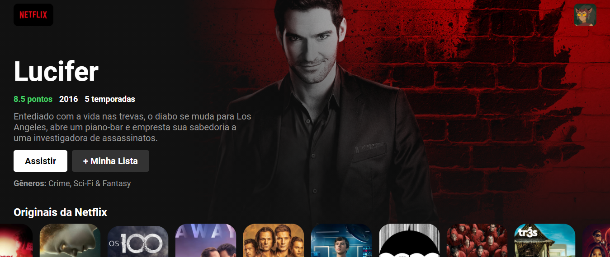
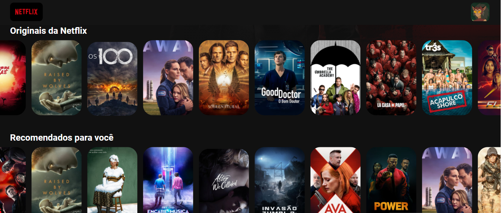

<h1 align="center"> Recriando a página inicial da Netflix <h1>

<h1>  
<h1> 

# Indice
- [Sobre](#-sobre)
- [Tecnologias utilizadas](#-tecnologias-utilizadas)
- [Como baixar o projeto](#-como-baixar-o-projeto)

---

# 📋 Sobre
Projeto **Clone Netflx** é uma página desenvolvida com fins educativos para consolidar conceitos de programação com **React**


---

## 🚀 Tecnologias utilizadas 

O projeto foi desenvolvido utilizando as seguintes tecnologias:

- [HTML](https://www.w3schools.com/html/)
- [CSS](https://www.w3schools.com/css/default.asp)
- [Javascript](https://www.w3schools.com/js/default.asp)
- [Node.js](https://nodejs.org/en/)
- [React](https://pt-br.reactjs.org/)


---

## 📁 Como baixar o projeto
```bash

    #Clonar repositório
    $ git clone https://github.com/JayG32/netflix_clone

    #Entre na pasta do projeto
    cd netflix_clone

    #Instale as dependencias
    npm install

    #Execute a aplicação
    npm start

```

---
Este projeto está licenciado nos termos da licença MIT  |  Desenvolvido por 👩‍💻 Janiele Nogueira